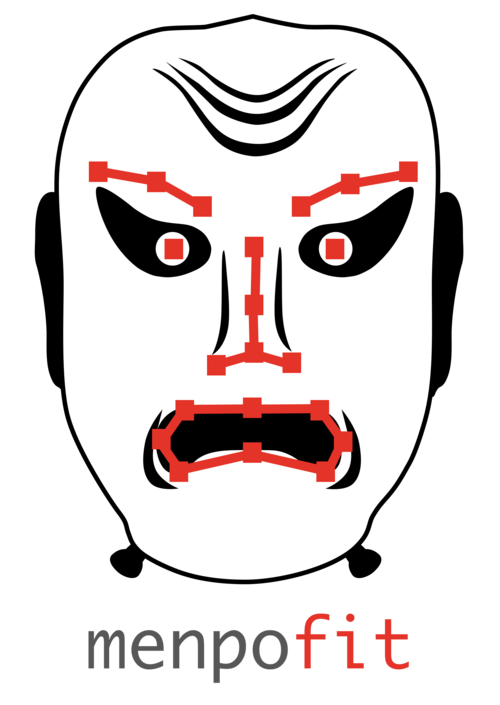

  

    
  
  
  
  

menpofit - A deformable modelling toolkit
=========================================
The [Menpo Project](http://www.menpo.org/) package for state-of-the-art 2D deformable modelling techniques.
Currently, the techniques that have been implemented include:

### Affine Image Alignment
  - **Lucas-Kanade Image Alignment**
    - _Optimization algorithms:_ Forward Additive, Forward/Inverse Compositional
    - _Residuals:_ SSD, Fourier SSD, ECC, Gradient Correlation, Gradient Images

### Deformable Image Alignment
  - **Active Template Model**
    - _Model variants:_ Holistic, Patch-based, Masked, Linear, Linear Masked
    - _Optimization algorithm:_ Lucas-Kanade Gradient Descent (Forward/Inverse Compositional)

### Landmark Localization
  - **Active Appearance Model**
    - _Model variants:_ Holistic, Patch-based, Masked, Linear, Linear Masked
    - _Optimization algorithms:_ Lucas-Kanade Gradient Descent (Alternating, Modified Alternating, Project Out, Simultaneous, Wiberg), Casaded-Regression
  - **Active Pictorial Structures**
    - _Model variant:_ Generative
    - _Optimization algorithm:_ Weighted Gauss-Newton Optimisation with fixed Jacobian and Hessian
  - **Constrained Local Model**
    - Active Shape Models
    - Regularized Landmark Mean-Shift
  - **Unified Active Appearance Model and Constrained Local Model**
    - Alternating/Project Out Regularized Landmark Mean-Shift
  - **Ensemble of Regression Trees**
    - \[provided by [DLib](http://dlib.net/)\]
  - **Supervised Descent Method**
    - _Model variants:_ Non Parametric, Parametric Shape, Parametric Appearance, Fully Parametric

Installation
------------
Here in the Menpo team, we are firm believers in making installation as simple
as possible. Unfortunately, we are a complex project that relies on satisfying
a number of complex 3rd party library dependencies. The default Python packing
environment does not make this an easy task. Therefore, we evangelise the use
of the conda ecosystem, provided by
[Anaconda](https://store.continuum.io/cshop/anaconda/). In order to make things
as simple as possible, we suggest that you use conda too! To try and persuade
you, go to the [Menpo website](http://www.menpo.io/installation/) to find
installation instructions for all major platforms.

Documentation
-------------
See our documentation on [ReadTheDocs](http://menpofit.readthedocs.org)

Pretrained Models
-----------------
Any pretrained models are provided under the assumption that they are used only for **academic** purposes and may not be used for commercial applications. Please see the license of the [300W](https://ibug.doc.ic.ac.uk/resources/300-W/) project - upon which our pretrained models are trained.

Specifically, the pretrained models in `menpofit.aam.pretrained` may only be used for academic purposes.
