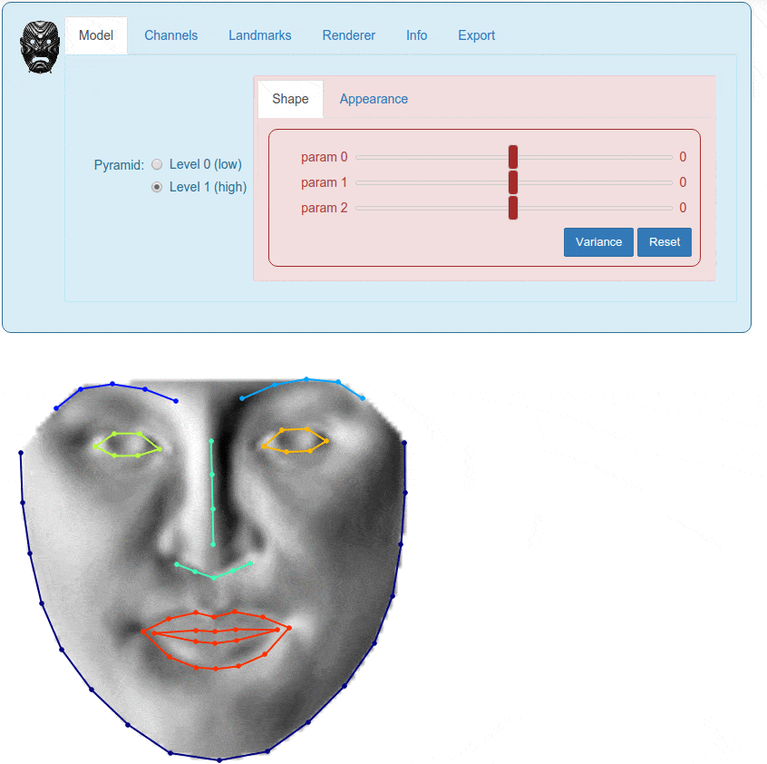

.. _ug-visualization:

Visualizing Objects
===================
In Menpo, we take an opinionated stance that visualization is a key part of
generating research on deformable models. Therefore, we tried to make the
mental overhead of visualizing objects as low as possible.

We also took a strong step towards simple visualization by integrating some of
our objects with visualization widgets for the Jupyter notebook. Remember that
our widgets live on their own repository, called **menpowidgets**.

Visualizing Models
------------------
Without further ado, a quick example of visualising the AAM trained in the
:ref:`Building <ug-building>` section with an interactive widget:

.. code-block:: python

    %matplotlib inline  # This is only needed if viewing in a Jupyter notebook
    aam.view_aam_widget()

   **Figure 1:** Example of visualizing an AAM using an interactive widget.

One can visualize the only the multi-scale shape models:

.. code-block:: python

    %matplotlib inline
    aam.view_shape_models_widget()

or the appearance models:

.. code-block:: python

    %matplotlib inline
    import menpo.io as mio
    aam.view_appearance_models_widget()

The same visualization widgets can be found in other models, such as ATM, CLM
etc.

Visualizing Fitting Result
--------------------------
The fitting result objects shown in :ref:`Building <ug-result>` can be easily
visualized. Specifically, the initial and final shapes can be rendered as:

.. code-block:: python

    %matplotlib inline
    result.view(render_initial_shape=True)

Similarly, the shapes acquired at each iteration can be visualized as:

.. code-block:: python

    %matplotlib inline
    fr.view_iterations()

and the corresponding errors as:

.. code-block:: python

    %matplotlib inline
    fr.plot_errors()

Finally, a fitting result can also be analysed through an interactive widget as:

.. code-block:: python

    %matplotlib inline
    fr.view_widget()

.. figure:: result.gif

   **Figure 2:** Example of visualizing the iterations of a fitting
   procedure using an interactive widget.
